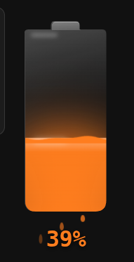

# Beautiful Battery


A 3D liquid glass battery card for Home Assistant with realistic liquid fill, glass effects, and mouse-interactive sloshing.



## Features

- Liquid fill with wave animation
- 3D glass effect with backdrop blur
- Mouse-interactive liquid sloshing
- Charge level color gradient
- Floating particle effects
- Charging/discharging drop animations
- Configurable glow intensity
- Multiple sizes (tiny, small, medium, large)
- Light/dark theme support
- Navigate action support
- Customizable colors

## Installation

### HACS (Recommended)

1. Open HACS in Home Assistant
2. Go to **Integrations** → **Custom repositories**
3. Add the URL: `https://github.com/kekko/ha-beautiful-battery`
4. Select **Lovelace Dashboard** as category
5. Click **Install**
6. Add the card to your dashboard using the raw editor

### Manual

1. Download `beautiful-battery.js` from the [latest release](https://github.com/kekko/ha-beautiful-battery/releases/latest)
2. Copy it to `config/www/community/`
3. Add the card to your dashboard

## Usage

```yaml
type: custom:beautiful-battery
entity: sensor.your_battery
name: My Battery
size: medium
show_percentage: true
show_status: true
show_voltage: false
show_power: false
glow_intensity: 0.8
animations:
  float: true
  liquid_movement: true
tap_action:
  action: more-info
```

## Configuration

| Property | Type | Default | Description |
|----------|------|---------|-------------|
| `entity` | string | **required** | Battery sensor entity |
| `name` | string | entity name | Display name |
| `size` | string | `medium` | `tiny` (100px), `small` (140px), `medium` (200px), `large` (260px) |
| `show_percentage` | boolean | `true` | Show percentage text |
| `show_status` | boolean | `true` | Show status text |
| `show_voltage` | boolean | `false` | Show voltage |
| `show_power` | boolean | `false` | Show power |
| `glow_intensity` | number | `0.8` | Glow intensity (0-1) |
| `voltage_entity` | string | | Voltage sensor entity |
| `power_entity` | string | | Power sensor entity |
| `charge_colors` | object | | Custom colors (see below) |
| `animations` | object | | Animation toggles |
| `tap_action` | object | | Tap action configuration |

### Colors

```yaml
charge_colors:
  low: '#ff4444'    # 0-25%
  mid: '#ffaa00'    # 25-50%
  high: '#44cc44'   # 50-75%
  full: '#00ddff'   # 75-100%
```

### Tap Actions

```yaml
# More info dialog
tap_action:
  action: more-info

# Toggle entity
tap_action:
  action: toggle

# Navigate to view
tap_action:
  action: navigate
  navigation_path: "#energy"

# Call service
tap_action:
  action: call-service
  service: light.toggle
  target:
    entity_id: light.living_room
```

## License

MIT
